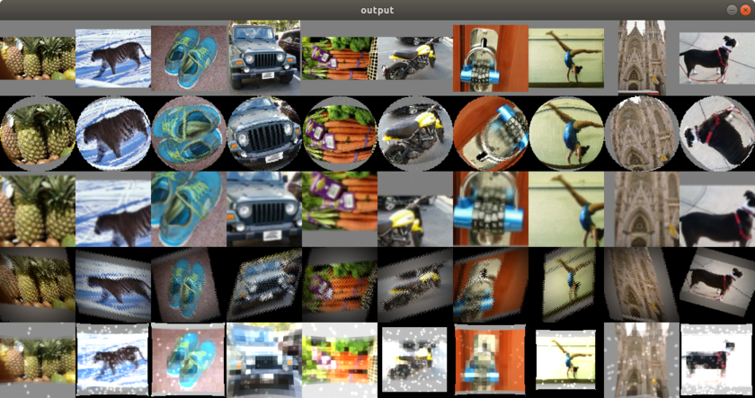

# Applications

rocAL has several applications built on top of AMD optimized libraries that can be used as prototypes or used as models to develop products.

## Prerequisites
* [rocAL](https://github.com/ROCmSoftwarePlatform/rocAL)

## Image Augmentation

This sample [application](./image_augmentation#image-augmentation-application) demonstrates the basic usage of rocAL's C API to load JPEG images from the disk and modify them in different possible ways and displays the output images.

  

