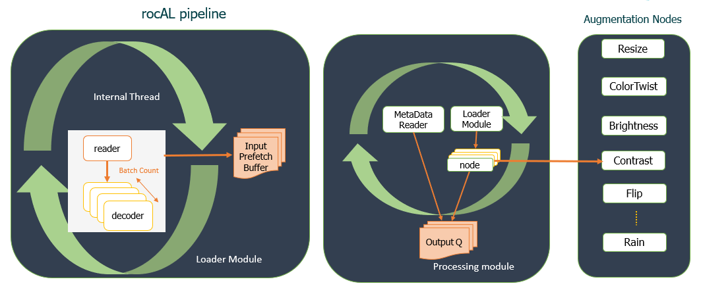

.. meta::
  :description: rocAL documentation and API reference library
  :keywords: rocAL, ROCm, API, documentation

.. _architecture:

********************************************************************
Architecture Components
********************************************************************

The rocAL architecture comprises rocAL Master-Graph and ROCm Performance Primitive (RPP) as major components.

rocAL Master-Graph
===================

The rocAL pipeline is built on top of rocAL Master-Graph. The architectural components of rocAL Master-Graph are described below:

**Loader and Processing Modules:** The rocAL Master-Graph consists of two main architectural components, a loader module to load data and a processing module to process data. The loader module is clearly separated from the processing module for a seamless execution without any blockages. The Prefetch queue helps to load data ahead of time and can be configured with user-defined parameters. The Output routine runs in parallel with the load routine, as both have separate queues for storing the result.

   rocAL Master-Graph Architecture

**rocAL Pipeline:** The rocAL pipeline holds great significance, as it contains all the information required to create a rocAL graph with data loader, augmentation nodes, and the output format. Once a rocAL pipeline is created, the user can build, run, and call an iterator to get the next batch of data into the pipeline. The user can install the rocAL pipeline using the rocAL Python package. It supports many operators for data loading and data augmentation.

ROCm Performance Primitive (RPP) Library
=========================================

RPP is a comprehensive high-performance computer vision library optimized for the AMD CPU and GPU with HIP and OpenCL backends. It is available under the AMD ROCm software platform. It provides low-level functionality for all rocAL operators for single, image, and tensor datatypes. RPP provides an extensive library for vision augmentations that includes vision functions, color augmentations, filter augmentations, geometric distortions, and a few more features. 

For more information on RPP along with the list of supported kernels, see `ROCm Performance Primitives <https://github.com/ROCm/rpp>`_.
