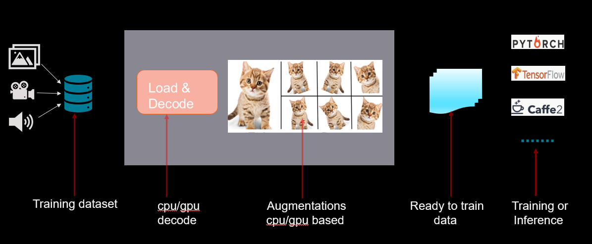

.. meta::
  :description: rocAL documentation and API reference library
  :keywords: rocAL, ROCm, API, documentation

.. _overview:

********************************************************************
rocAL Overview
********************************************************************

Overview
==========

The performance of Deep Learning applications depends upon the efficiency of performance pipelines that can load and preprocess data efficiently to provide a high throughput. The pipelines are typically used to perform tasks such as loading and decoding data, perform a variety of augmentations, perform color-format conversions, etc., before passing the data for training or inference. The Deep Learning frameworks also require the pipelines to support multiple data formats and augmentations to adapt to a variety of datasets and models. This can be achieved by creating processing pipelines that fully utilize the underlying hardware capabilities.

ROCm™ Augmentation Library (rocAL™) lets the user create hybrid pipelines to maximize the throughput for Machine Learning applications. It helps to create pipelines that can efficiently process images, videos, and a variety of storage formats. The user can program these pipelines using C or Python API. rocAL significantly accelerates data processing on AMD processors. 

To optimize the preprocessing pipeline, rocAL utilizes the following features:

- Prefetching: Loads the data for the next batch while the existing batch is under process. This parallelization allows more batches to be processed in less time.
- Hybrid execution: Utilizes both the CPU and GPU simultaneously. For example, decoding the data on the CPU while running the training on the GPU. 
- Hardware decoding: Uses the AMD VCN and VA-API to efficiently decode data on the hardware. 
- Batch processing: Groups and processes the data together as a batch.

   The Role of Pipelines in Deep Learning Applications

Key Components
================

- CPU- or GPU-based implementation for each augmentation and data_loader nodes
- Python and C APIs for easy integration and testing
- Multiple framework support and portable on PyTorch, TensorFlow, and MXNet
- Flexible graphs to help the user create custom pipelines
- Multicore host and multi-gpu execution for the graph
- Support for various augmentations such as fish-eye, water, gitter, non-linear blend, etc., using the AMD ROCm Performance Primitive (RPP) library
- Support for classification, object detection, segmentation, and keypoint data pipelines

Third-party Integration
========================

rocAL provides support for many operators. The module imports are designed like other available data loaders for a smooth integration with training frameworks. The rocal_pybind package provides support for integrating with PyTorch, TensorFlow, and Caffe2. rocAL also supports many data formats such as FileReader, COCO Reader, TFRecordReader, and Lightning Memory-Mapped Database (LMDB), thus offering a unified approach to framework integration.

rocAL Operators
=================

rocAL operators offer the flexibility to run on CPU or GPU for building hybrid pipelines. They also support classification and object detection on the workload. Some of the useful operators supported by rocAL are listed below:

* **Augmentations:** These are used to enhance the data set by adding effects to the original images. 
  To use the augmentations, import the instance of ``amd.rocal.fn`` into the Python script. These augmentation 
  APIs further call the RPP kernels underneath (HIP/HOST) depending on the backend used to build RPP and rocAL.

* **Readers:** These are used to read and understand the different types of datasets and their metadata. Some 
  examples of readers are list of files with folders, LMDB, TFRecord, and JSON file for metadata. To use the 
  readers, import the instance of ``amd.rocal.readers`` into the Python script.

* **Decoders:** These are used to support different input formats of images and videos. Decoders extract 
  data from the datasets that are in compressed formats such as JPEG, MP4, etc. To use the decoders, 
  import the instance of ``amd.rocal.decoders`` into the Python script.

Table 1. 	Augmentations Available through rocAL
--------------------------------------------------------

=====================  =========================  =========================================
Color Augmentations    Effects Augmentations      Geometry Augmentations                                                              
=====================  =========================  =========================================
| Blend                | Fog                      | Crop                                  
| Blur                 | Jitter                   | Crop Mirror Normalization             
| Brightness           | Pixelization             | Crop Resize                           
| Color Temperature    | Raindrops                | Fisheye Lens                          
| Color Twist          | Snowflakes               | Flip (Horizontal, Vertical, and Both) 
| Contrast             | Salt and Pepper Noise    | Lens Correction                       
| Exposure             |                          | Random Crop                           
| Gamma                |                          | Resize                                
| Hue                  |                          | Resize Crop Mirror                    
| Saturation           |                          | Rotation                              
| Vignette             |                          | Warp Affine            
=====================  =========================  =========================================

Table 2.	Readers Available through rocAL
--------------------------------------------------

==========================================  =====================================================
Readers                                     Description                                         
==========================================  =====================================================
| File Reader                               | Reads images from a list of files in a folder(s)    
| Video Reader                              | Reads videos from a list of files in a folder(s)    
| Caffe LMDB Reader                         | Reads (key, value) pairs from Caffe LMDB            
| Caffe2 LMDB Reader                        | Reads (key, value) pairs from Caffe2 LMDB           
| COCO Reader – file source and keypoints   | Reads images and JSON annotations from COCO dataset 
| TFRecord Reader                           | Reads from a TFRecord dataset                       
| MXNet Reader                              | Reads from a RecordIO dataset                       
==========================================  =====================================================

Table 3.	Decoders Available through rocAL
---------------------------------------------------

======================  ========================================
Decoders                Description                            
======================  ========================================
| Image                 | Decodes JPEG images                    
| Image_raw             | Decodes images in raw format           
| Image_random_crop     | Decodes and randomly crops JPEG images 
| Image_slice           | Decodes and slices JPEG images         
======================  ========================================

To see examples demonstrating the usage of decoders and readers, see 
`MIVisionX rocAL Python Binding Examples <https://github.com/ROCm/MIVisionX/tree/master/rocAL/rocAL_pybind/examples>`_.
